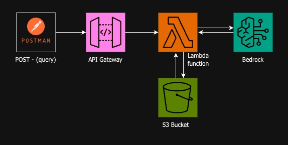

# Blog Generator with Amazon Bedrock

This repository contains an end-to-end project that generates a blog post on a given topic using Amazon Bedrock. 

## Contents
- [Architecture](#architecture)
- [Requirements](#requirements)
    - [Lambda](#lambda)
    - [API Gateway](#api-gateway)
    - [S3](#s3-bucket)
- [Usage](#usage)

## Architecture


How it works:

- A POST request is made to the lambda function with the blog topic in the request body.
- The lambda function takes the argument and creates a prompt for the model in bedrock to generate a blog post.
- If successful, the blog is generated and saved in a S3 bucket, else an error message is returned.

The model used in this project is [Meta's](https://github.com/meta-llama/llama/blob/main/MODEL_CARD.md) `Llama 2 Chat 13B`(bedrock modelId: `"meta.llama2-13b-chat-v1"`)

## Requirements
- boto3
- json
- datetime

```bash
pip install boto3
```
### Lambda
Create a Lambda function with Python 3.12 runtime, set timeout to 10 seconds, attach required policies to the execution role. 

for the lambda function to have the latest boto3 library version do the following:

- install boto3 to a folder and compress that folder to a zip file.

```bash
pip install boto3 -t boto3-layer/ 
```
- publish the layer either manually (at console) or through AWS CLI

```bash
aws lambda publish-layer-version --layer-name boto3-layer --zip-file fileb:///path/to/zip/file.zip
```
### API Gateway
Create a `HTTP API` and a `POST route`, integrate it with the Lambda function created.
Head over to stages and get the Invoke URL. This is the URL to which you will send POST requests to.
### S3 Bucket
Create an S3 bucket.
```bash
aws s3api create-bucket --bucket bucket-name -- region us-east-1
```
## Usage

send the topic through a POST request to the invoke URL.

Here's a POST request and the response:

```http
POST /dev/blog_generator HTTP/1.1
Host: ----------.execute-api.us-east-1.amazonaws.com
Content-Type: application/json
Content-Length: 28

{
  "blog_topic":"Bitcoin"
}
```

```http
HTTP/1.1 200 OK
Date: Wed, 22 May 2024 03:57:30 GMT
Content-Type: text/plain; charset=utf-8
Content-Length: 29
Connection: keep-alive
Apigw-Requestid: YJ39QgSNoAMEYDA=

"Blog generated successfully"
```
access your s3 bucket to view the objects.
```bash 
aws s3 ls s3://your-bucket-name/blog-output/
```
```bash 
aws s3 cp s3://your-bucket-name/blog-output/035730.txt 035730.txt
```
```bash
cat 035730.txt
```